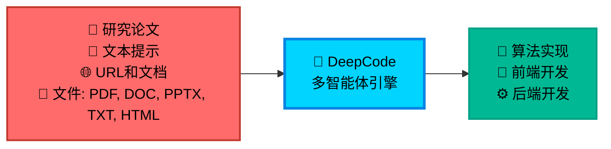
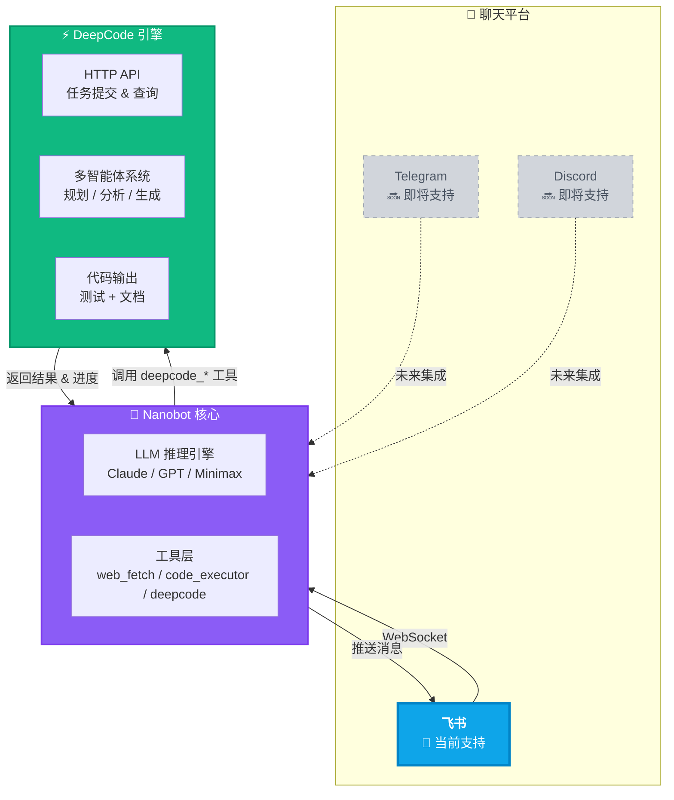

<div align="center">

<table style="border: none; margin: 0 auto; padding: 0; border-collapse: collapse;">
<tr>
<td align="center" style="vertical-align: middle; padding: 10px; border: none; width: 250px;">
  
</td>
<td align="left" style="vertical-align: middle; padding: 10px 0 10px 30px; border: none;">
  <pre style="font-family: 'Courier New', monospace; font-size: 16px; color: #0EA5E9; margin: 0; padding: 0; text-shadow: 0 0 10px #0EA5E9, 0 0 20px rgba(14,165,233,0.5); line-height: 1.2; transform: skew(-1deg, 0deg); display: block;">    ██████╗ ███████╗███████╗██████╗  ██████╗ ██████╗ ██████╗ ███████╗
    ██╔══██╗██╔════╝██╔════╝██╔══██╗██╔════╝██╔═══██╗██╔══██╗██╔════╝
    ██║  ██║█████╗  █████╗  ██████╔╝██║     ██║   ██║██║  ██║█████╗
    ██║  ██║██╔══╝  ██╔══╝  ██╔═══╝ ██║     ██║   ██║██║  ██║██╔══╝
    ██████╔╝███████╗███████╗██║     ╚██████╗╚██████╔╝██████╔╝███████╗
    ╚═════╝ ╚══════╝╚══════╝╚═╝      ╚═════╝ ╚═════╝ ╚═════╝ ╚══════╝</pre>
</td>
</tr>
</table>

<div align="center">
<a href="https://trendshift.io/repositories/14665" target="_blank"></a>
</div>

<!--  -->

#  DeepCode: 开源智能体编程

### *基于多智能体系统推进代码生成技术*

<!-- <p align="center">
  

  
  
  
</p> -->
<p>
  <a href="https://github.com/HKUDS/DeepCode/stargazers"></a>
  
  <a href="https://pypi.org/project/deepcode-hku/"></a>
</p>
<p>
  <a href="https://discord.gg/yF2MmDJyGJ"></a>
  <a href="https://github.com/HKUDS/DeepCode/issues/11"></a>
</p>
<div align="center">
  <div style="width: 100%; height: 2px; margin: 20px 0; background: linear-gradient(90deg, transparent, #00d9ff, transparent);"></div>
</div>

<div align="center">
  <a href="#-快速开始" style="text-decoration: none;">
    
  </a>
</div>

<div align="center" style="margin-top: 10px;">
  <a href="README.md">
    
  </a>
  <a href="README_ZH.md">
    
  </a>
</div>

### 🖥️ **界面展示**

<table align="center" width="100%" style="border: none; border-collapse: collapse; margin: 30px 0;">
<tr>
<td width="50%" align="center" style="vertical-align: top; padding: 20px;">

#### 🖥️ **命令行界面**
**基于终端的开发环境**

<div align="center">

  

  <div style="background: linear-gradient(135deg, #2D3748 0%, #4A5568 100%); border-radius: 12px; padding: 15px; margin: 15px 0; color: white;">
    <strong>🚀 高级终端体验</strong><br/>
    <small>⚡ 快速命令行工作流<br/>🔧 开发者友好界面<br/>📊 实时进度跟踪</small>
  </div>

  *专业终端界面，适合高级用户和CI/CD集成*
</div>

</td>
<td width="50%" align="center" style="vertical-align: top; padding: 20px;">

#### 🌐 **Web界面**
**可视化交互体验**

<div align="center">

  

  <div style="background: linear-gradient(135deg, #0EA5E9 0%, #00D4FF 100%); border-radius: 12px; padding: 15px; margin: 15px 0; color: white;">
    <strong>🎨 现代化Web仪表板</strong><br/>
    <small>🖱️ 直观的拖拽操作<br/>📱 响应式设计<br/>🎯 可视化进度跟踪</small>
  </div>

  *美观的Web界面，为所有技能水平用户提供流畅的工作流程*
</div>

</td>
</tr>
</table>

---

<div align="center">

### 🎬 **介绍视频**

<div style="margin: 20px 0;">
  <a href="https://youtu.be/PRgmP8pOI08" target="_blank">
    
  </a>
</div>

*🎯 **观看我们的完整介绍** - 了解DeepCode如何将研究论文和自然语言转换为生产就绪的代码*

<p>
  <a href="https://youtu.be/PRgmP8pOI08" target="_blank">
    
  </a>
</p>

</div>

---


> *"AI智能体将创意转化为生产就绪代码的地方"*

</div>

---

## 📑 目录

- [📰 新闻](#-新闻)
- [🚀 核心特性](#-核心特性)
- [🏗️ 架构](#️-架构)
- [📊 实验结果](#-实验结果)
- [🚀 快速开始](#-快速开始)
- [🤖 nanobot 集成（飞书聊天机器人）](#-nanobot-集成飞书聊天机器人)
- [💡 示例](#-示例)
  - [🎬 实时演示](#-实时演示)
- [⭐ 星标历史](#-星标历史)
- [📄 许可证](#-许可证)

---

## 📰 新闻

🎉 **[2025-02] DeepCode + nanobot 集成 — 通过飞书聊天使用 DeepCode！**

<div align="center">
<table><tr>
<td align="center"><a href="https://github.com/HKUDS/DeepCode"></a></td>
<td align="center"><h2>✦</h2></td>
<td align="center"><a href="https://github.com/HKUDS/nanobot"></a></td>
</tr></table>
</div>

- [nanobot](https://github.com/HKUDS/nanobot) 现已连接到 DeepCode — 在**飞书**中发送消息即可自动生成代码
- 支持**论文转代码**和**对话转代码**，以及实时任务跟踪，全部在聊天应用中完成
- 一键部署：`./nanobot/run_nanobot.sh` → **[设置指南 →](#-nanobot-集成飞书聊天机器人)**

<div align="center">
<table width="100%"><tr>
<td width="50%" align="center">
  
</td>
<td width="50%" align="center">
  
</td>
</tr></table>
<sub><em>飞书机器人实战 — 自然语言 → 完整代码生成，带设置说明</em></sub>
</div>

---

🎉 **[2025-02] 全新 Web UI 体验升级！**

- 🔄 **用户交互循环 (User-in-Loop)**: 支持工作流程中的实时用户交互，AI 会在对话中向您提问以澄清需求
- 💬 **内联交互设计**: 交互问题直接显示在对话框中，体验更自然流畅
- 🚀 **一键启动**: 运行 `deepcode` 即可启动新版 UI（跨平台支持：Windows/macOS/Linux）
- 🔧 **优化的进程管理**: 改进了服务启停机制，自动清理端口占用
- 📡 **WebSocket 实时通信**: 修复了消息丢失问题，确保交互状态正确同步

<div align="center">
  
  <br/>
  <sub><em>DeepCode 全新 Web UI - 基于 React 的现代界面</em></sub>
</div>

---

🎉 **[2025-10-28] DeepCode在PaperBench上达到最先进水平！**

DeepCode在OpenAI的PaperBench Code-Dev所有类别中创造新基准：

- 🏆 **超越人类专家**: **75.9%** (DeepCode) vs 顶级机器学习博士 72.4% (+3.5%)。
- 🥇 **超越最先进商业代码智能体**: **84.8%** (DeepCode) vs 领先商业代码智能体 (+26.1%) (Cursor, Claude Code, 和 Codex)。
- 🔬 **推进科学编程**: **73.5%** (DeepCode) vs PaperCoder 51.1% (+22.4%)。
- 🚀 **击败LLM智能体**: **73.5%** (DeepCode) vs 最佳LLM框架 43.3% (+30.2%)。

---

## 🚀 核心特性

<br/>

<table align="center" width="100%" style="border: none; table-layout: fixed;">
<tr>
<td width="30%" align="center" style="vertical-align: top; padding: 20px;">

<div style="height: 80px; display: flex; align-items: center; justify-content: center;">
<h3 style="margin: 0; padding: 0;">🚀 <strong>论文转代码</strong></h3>
</div>

<div align="center" style="margin: 15px 0;">
  
</div>

<div style="height: 80px; display: flex; align-items: center; justify-content: center;">
<p align="center"><strong>复杂算法的自动化实现</strong></p>
</div>

<div style="height: 60px; display: flex; align-items: center; justify-content: center;">
<p align="center">轻松将研究论文中的复杂算法转换为<strong>高质量</strong>、<strong>生产就绪</strong>的代码，加速算法复现。</p>
</div>


</td>
<td width="30%" align="center" style="vertical-align: top; padding: 20px;">

<div style="height: 80px; display: flex; align-items: center; justify-content: center;">
<h3 style="margin: 0; padding: 0;">🎨 <strong>文本转Web</strong></h3>
</div>

<div align="center" style="margin: 15px 0;">
  
</div>

<div style="height: 80px; display: flex; align-items: center; justify-content: center;">
<p align="center"><strong>自动化前端Web开发</strong></p>
</div>

<div style="height: 60px; display: flex; align-items: center; justify-content: center;">
<p align="center">将纯文本描述转换为<strong>功能完整</strong>、<strong>视觉美观</strong>的前端Web代码，快速创建界面。</p>
</div>


</td>
<td width="30%" align="center" style="vertical-align: top; padding: 20px;">

<div style="height: 80px; display: flex; align-items: center; justify-content: center;">
<h3 style="margin: 0; padding: 0;">⚙️ <strong>文本转后端</strong></h3>
</div>

<div align="center" style="margin: 15px 0;">
  
</div>

<div style="height: 80px; display: flex; align-items: center; justify-content: center;">
<p align="center"><strong>自动化后端开发</strong></p>
</div>

<div style="height: 60px; display: flex; align-items: center; justify-content: center;">
<p align="center">从简单的文本输入生成<strong>高效</strong>、<strong>可扩展</strong>和<strong>功能丰富</strong>的后端代码，简化服务器端开发。</p>
</div>


</td>
</tr>
</table>

<br/>

---

## 📊 实验结果

<div align="center">
    <br>
</div>
<br/>

我们在[*PaperBench*](https://openai.com/index/paperbench/)基准测试（由OpenAI发布）上评估**DeepCode**，这是一个严格的测试平台，要求AI智能体从头独立复现20篇ICML 2024论文。该基准包含8,316个可评分组件，使用带有分层权重的SimpleJudge进行评估。

我们的实验将DeepCode与四个基线类别进行比较：**(1) 人类专家**，**(2) 最先进商业代码智能体**，**(3) 科学代码智能体**，以及 **(4) 基于LLM的智能体**。

### ① 🧠 人类专家表现（顶级机器学习博士）

**DeepCode: 75.9% vs. 顶级机器学习博士: 72.4% (+3.5%)**

DeepCode在3篇论文的人类评估子集上达到**75.9%**，**超越3次人类专家基线（72.4%）+3.5个百分点**。这表明我们的框架不仅匹配而且超越了专家级代码复现能力，代表了自主科学软件工程的重要里程碑。

### ② 💼 最先进商业代码智能体

**DeepCode: 84.8% vs. 最佳商业智能体: 58.7% (+26.1%)**

在5篇论文的子集上，DeepCode大幅超越领先的商业编码工具：
- Cursor: 58.4%
- Claude Code: 58.7%
- Codex: 40.0%
- **DeepCode: 84.8%**

这代表了相对于领先商业代码智能体的**+26.1%改进**。所有商业智能体都使用Claude Sonnet 4.5或GPT-5 Codex-high，突出了**DeepCode的卓越架构**——而非基础模型能力——推动了这一性能差距。

### ③ 🔬 科学代码智能体

**DeepCode: 73.5% vs. PaperCoder: 51.1% (+22.4%)**

与最先进的科学代码复现框架PaperCoder（**51.1%**）相比，DeepCode达到**73.5%**，展示了**+22.4%的相对改进**。这一显著差距验证了我们结合规划、分层任务分解、代码生成和迭代调试的多模块架构优于简单的管道式方法。

### ④ 🤖 基于LLM的智能体

**DeepCode: 73.5% vs. 最佳LLM智能体: 43.3% (+30.2%)**

DeepCode显著超越所有测试的LLM智能体：
- Claude 3.5 Sonnet + IterativeAgent: 27.5%
- o1 + IterativeAgent (36小时): 42.4%
- o1 BasicAgent: 43.3%
- **DeepCode: 73.5%**

相对于表现最佳的LLM智能体的**+30.2%改进**表明，复杂的智能体框架，而非延长的推理时间或更大的模型，对于复杂的代码复现任务至关重要。

---

### 🎯 **自主多智能体工作流**

**面临的挑战**:

- 📄 **实现复杂性**: 将学术论文和复杂算法转换为可运行代码需要大量技术投入和领域专业知识

- 🔬 **研究瓶颈**: 研究人员将宝贵时间花在算法实现上，而不是专注于核心研究和发现工作

- ⏱️ **开发延迟**: 产品团队在概念和可测试原型之间经历长时间等待，减慢创新周期

- 🔄 **重复编码**: 开发者重复实现相似的模式和功能，而不是基于现有解决方案构建

**DeepCode** 通过为常见开发任务提供可靠的自动化来解决这些工作流程低效问题，简化从概念到代码的开发工作流程。

<div align="center">



</div>

---

## 🏗️ 架构

### 📊 **系统概述**

**DeepCode** 是一个AI驱动的开发平台，自动化代码生成和实现任务。我们的多智能体系统处理将需求转换为功能性、结构良好代码的复杂性，让您专注于创新而非实现细节。

🎯 **技术能力**:

🧬 **研究到生产流水线**<br>
多模态文档分析引擎，从学术论文中提取算法逻辑和数学模型。生成优化的实现，使用适当的数据结构，同时保持计算复杂度特征。

🪄 **自然语言代码合成**<br>
使用在精选代码库上训练的微调语言模型进行上下文感知代码生成。在支持多种编程语言和框架的同时保持模块间架构一致性。

⚡ **自动化原型引擎**<br>
智能脚手架系统，生成包括数据库模式、API端点和前端组件的完整应用程序结构。使用依赖分析确保从初始生成开始的可扩展架构。

💎 **质量保证自动化**<br>
集成静态分析与自动化单元测试生成和文档合成。采用AST分析进行代码正确性检查和基于属性的测试进行全面覆盖。

🔮 **CodeRAG集成系统**<br>
高级检索增强生成，结合语义向量嵌入和基于图的依赖分析。从大规模代码语料库中自动发现最优库和实现模式。

---

### 🔧 **核心技术**

- 🧠 **智能编排智能体**: 协调工作流阶段和分析需求的中央决策系统。采用动态规划算法，根据不断发展的项目复杂性实时调整执行策略。为每个实现步骤动态选择最优处理策略。 <br>

- 💾 **高效内存机制**: 高效管理大规模代码上下文的高级上下文工程系统。实现分层内存结构，具有智能压缩功能，用于处理复杂代码库。该组件实现实现模式的即时检索，并在扩展开发会话中保持语义一致性。 <br>

- 🔍 **高级CodeRAG系统**: 分析跨存储库复杂相互依赖关系的全局代码理解引擎。执行跨代码库关系映射，从整体角度理解架构模式。该模块利用依赖图和语义分析在实现过程中提供全局感知的代码建议。

---

### 🤖 **DeepCode的多智能体架构**:

- **🎯 中央编排智能体**: 编排整个工作流程执行并做出战略决策。基于输入复杂性分析协调专门智能体。实现动态任务规划和资源分配算法。 <br>

- **📝 意图理解智能体**: 对用户需求进行深度语义分析以解码复杂意图。通过高级NLP处理提取功能规范和技术约束。通过结构化任务分解将模糊的人类描述转换为精确、可操作的开发规范。 <br>

- **📄 文档解析智能体**: 使用高级解析能力处理复杂的技术文档和研究论文。使用文档理解模型提取算法和方法。通过智能内容分析将学术概念转换为实用的实现规范。 <br>

- **🏗️ 代码规划智能体**: 执行架构设计和技术栈优化。动态规划适应性开发路线图。通过自动化设计模式选择执行编码标准并生成模块化结构。<br>

- **🔍 代码参考挖掘智能体**: 通过智能搜索算法发现相关存储库和框架。分析代码库的兼容性和集成潜力。基于相似性度量和自动化依赖分析提供建议。 <br>

- **📚 代码索引智能体**: 构建发现代码库的综合知识图谱。维护代码组件之间的语义关系。实现智能检索和交叉引用能力。 <br>

- **🧬 代码生成智能体**: 将收集的信息合成为可执行的代码实现。创建功能接口并集成发现的组件。生成全面的测试套件和文档以确保可重现性。

---

#### 🛠️ **实现工具矩阵**

**🔧 基于MCP (模型上下文协议) 驱动**

DeepCode利用**模型上下文协议 (MCP)** 标准与各种工具和服务无缝集成。这种标准化方法确保AI智能体和外部系统之间的可靠通信，实现强大的自动化能力。

##### 📡 **MCP服务器和工具**

| 🛠️ **MCP服务器** | 🔧 **主要功能** | 💡 **目的和能力** |
|-------------------|-------------------------|-------------------------------|
| **🔍 brave** | Web搜索引擎 | 通过Brave搜索API进行实时信息检索 |
| **🌐 bocha-mcp** | 替代搜索 | 具有独立API访问的辅助搜索选项 |
| **📂 filesystem** | 文件系统操作 | 本地文件和目录管理，读/写操作 |
| **🌐 fetch** | Web内容检索 | 从URL和Web资源获取和提取内容 |
| **📥 github-downloader** | 存储库管理 | 克隆和下载GitHub存储库进行分析 |
| **📋 file-downloader** | 文档处理 | 下载文件(PDF、DOCX等)并转换为Markdown |
| **⚡ command-executor** | 系统命令 | 执行bash/shell命令进行环境管理 |
| **🧬 code-implementation** | 代码生成中心 | 具有执行和测试的综合代码复现 |
| **📚 code-reference-indexer** | 智能代码搜索 | 代码存储库的智能索引和搜索 |
| **📄 document-segmentation** | 智能文档分析 | 大型论文和技术文档的智能文档分割 |

##### 🔧 **传统工具功能** *(供参考)*

| 🛠️ **功能** | 🎯 **使用上下文** |
|-----------------|---------------------|
| **📄 read_code_mem** | 从内存高效检索代码上下文 |
| **✍️ write_file** | 直接文件内容生成和修改 |
| **🐍 execute_python** | Python代码测试和验证 |
| **📁 get_file_structure** | 项目结构分析和组织 |
| **⚙️ set_workspace** | 动态工作空间和环境配置 |
| **📊 get_operation_history** | 过程监控和操作跟踪 |


---

🎛️ **多界面框架**<br>
具有CLI和Web前端的RESTful API，具有实时代码流、交互式调试和可扩展插件架构，用于CI/CD集成。

**🚀 多智能体智能流水线:**

<div align="center">

### 🌟 **智能处理流程**

<table align="center" width="100%" style="border: none; border-collapse: collapse;">
<tr>
<td colspan="3" align="center" style="padding: 20px; background: linear-gradient(135deg, #667eea 0%, #764ba2 100%); border-radius: 15px; color: white; font-weight: bold;">
💡 <strong>输入层</strong><br/>
📄 研究论文 • 💬 自然语言 • 🌐 URL • 📋 需求
</td>
</tr>
<tr><td colspan="3" height="20"></td></tr>
<tr>
<td colspan="3" align="center" style="padding: 15px; background: linear-gradient(135deg, #ff6b6b 0%, #ee5a24 100%); border-radius: 12px; color: white; font-weight: bold;">
🎯 <strong>中央编排</strong><br/>
战略决策制定 • 工作流程协调 • 智能体管理
</td>
</tr>
<tr><td colspan="3" height="15"></td></tr>
<tr>
<td align="center" style="padding: 12px; background: linear-gradient(135deg, #3742fa 0%, #2f3542 100%); border-radius: 10px; color: white; width: 50%;">
📝 <strong>文本分析</strong><br/>
<small>需求处理</small>
</td>
<td width="10"></td>
<td align="center" style="padding: 12px; background: linear-gradient(135deg, #8c7ae6 0%, #9c88ff 100%); border-radius: 10px; color: white; width: 50%;">
📄 <strong>文档分析</strong><br/>
<small>论文和规范处理</small>
</td>
</tr>
<tr><td colspan="3" height="15"></td></tr>
<tr>
<td colspan="3" align="center" style="padding: 15px; background: linear-gradient(135deg, #00d2d3 0%, #54a0ff 100%); border-radius: 12px; color: white; font-weight: bold;">
📋 <strong>复现规划</strong><br/>
深度论文分析 • 代码需求解析 • 复现策略开发
</td>
</tr>
<tr><td colspan="3" height="15"></td></tr>
<tr>
<td align="center" style="padding: 12px; background: linear-gradient(135deg, #ffa726 0%, #ff7043 100%); border-radius: 10px; color: white; width: 50%;">
🔍 <strong>参考分析</strong><br/>
<small>存储库发现</small>
</td>
<td width="10"></td>
<td align="center" style="padding: 12px; background: linear-gradient(135deg, #e056fd 0%, #f368e0 100%); border-radius: 10px; color: white; width: 50%;">
📚 <strong>代码索引</strong><br/>
<small>知识图谱构建</small>
</td>
</tr>
<tr><td colspan="3" height="15"></td></tr>
<tr>
<td colspan="3" align="center" style="padding: 15px; background: linear-gradient(135deg, #26de81 0%, #20bf6b 100%); border-radius: 12px; color: white; font-weight: bold;">
🧬 <strong>代码实现</strong><br/>
实现生成 • 测试 • 文档
</td>
</tr>
<tr><td colspan="3" height="15"></td></tr>
<tr>
<td colspan="3" align="center" style="padding: 20px; background: linear-gradient(135deg, #045de9 0%, #09c6f9 100%); border-radius: 15px; color: white; font-weight: bold;">
⚡ <strong>输出交付</strong><br/>
📦 完整代码库 • 🧪 测试套件 • 📚 文档 • 🚀 部署就绪
</td>
</tr>
</table>

</div>

<div align="center">
<br/>

### 🔄 **流程智能特性**

<table align="center" style="border: none;">
<tr>
<td align="center" width="25%" style="padding: 15px;">
<div style="background: #f8f9fa; border-radius: 10px; padding: 15px; border-left: 4px solid #ff6b6b;">
<h4>🎯 自适应流程</h4>
<p><small>基于输入复杂性的动态智能体选择</small></p>
</div>
</td>
<td align="center" width="25%" style="padding: 15px;">
<div style="background: #f8f9fa; border-radius: 10px; padding: 15px; border-left: 4px solid #4ecdc4;">
<h4>🧠 智能协调</h4>
<p><small>智能任务分配和并行处理</small></p>
</div>
</td>
<td align="center" width="25%" style="padding: 15px;">
<div style="background: #f8f9fa; border-radius: 10px; padding: 15px; border-left: 4px solid #45b7d1;">
<h4>🔍 上下文感知</h4>
<p><small>通过CodeRAG集成的深度理解</small></p>
</div>
</td>
<td align="center" width="25%" style="padding: 15px;">
<div style="background: #f8f9fa; border-radius: 10px; padding: 15px; border-left: 4px solid #96ceb4;">
<h4>⚡ 质量保证</h4>
<p><small>全程自动化测试和验证</small></p>
</div>
</td>
</tr>
</table>

</div>

---

## 🚀 快速开始

### 📋 **前置条件**

在安装 DeepCode 之前，请确保您已安装以下软件：

| 要求 | 版本 | 用途 |
|------|------|------|
| **Python** | 3.9+ | 核心运行环境 |
| **Node.js** | 18+ | 新版 UI 前端 |
| **npm** | 8+ | 包管理工具 |

```bash
# 检查您的版本
python --version   # 应为 3.9+
node --version     # 应为 18+
npm --version      # 应为 8+
```

<details>
<summary><strong>📥 安装 Node.js（如果未安装）</strong></summary>

```bash
# macOS (使用 Homebrew)
brew install node

# Ubuntu/Debian
curl -fsSL https://deb.nodesource.com/setup_20.x | sudo -E bash -
sudo apt-get install -y nodejs

# Windows
# 从 https://nodejs.org/ 下载安装
```

</details>

### 📦 **步骤1: 安装**

选择以下任一安装方式：

#### ⚡ **直接安装 (推荐)**

```bash
# 🚀 直接安装 DeepCode 包
pip install deepcode-hku

# 🔑 下载配置文件
curl -O https://raw.githubusercontent.com/HKUDS/DeepCode/main/mcp_agent.config.yaml
curl -O https://raw.githubusercontent.com/HKUDS/DeepCode/main/mcp_agent.secrets.yaml
```

#### 🔧 **开发安装 (从源码)**

<details>
<summary><strong>📂 点击展开开发安装选项</strong></summary>

##### 🔥 **使用 UV (开发推荐)**

```bash
git clone https://github.com/HKUDS/DeepCode.git
cd DeepCode/

curl -LsSf https://astral.sh/uv/install.sh | sh
uv venv --python=3.13
source .venv/bin/activate  # Windows下: .venv\Scripts\activate
uv pip install -r requirements.txt

# 安装前端依赖
npm install --prefix new_ui/frontend
```

##### 🐍 **使用传统 pip**

```bash
git clone https://github.com/HKUDS/DeepCode.git
cd DeepCode/

pip install -r requirements.txt

# 安装前端依赖
npm install --prefix new_ui/frontend
```

</details>

### 🔧 **步骤2: 配置**

> 以下配置适用于**所有安装方式**（pip、UV、源码安装和 Docker 均通用）。

#### 🔑 API 密钥 *（必需）*

编辑 `mcp_agent.secrets.yaml`，填入你的 API 密钥：

```yaml
# 至少需要配置一个 LLM 提供商的 API Key
openai:
  api_key: "your_openai_api_key"
  base_url: "https://openrouter.ai/api/v1"  # 可选: 用于 OpenRouter 或自定义端点

anthropic:
  api_key: "your_anthropic_api_key"  # 用于 Claude 模型

google:
  api_key: "your_google_api_key"     # 用于 Gemini 模型
```

#### 🤖 LLM 提供商 *（可选）*

编辑 `mcp_agent.config.yaml` 选择你偏好的 LLM 提供商（第 ~106 行）：

```yaml
# 选项: "google", "anthropic", "openai"
# 如果未设置或不可用，将自动回退到第一个可用的提供商
llm_provider: "google"
```

#### 🔍 搜索 API 密钥 *（可选）*

在 `mcp_agent.config.yaml` 中配置 Web 搜索：

```yaml
# Brave 搜索 (默认) — 在 brave.env 部分设置 (第 ~28 行)
brave:
  env:
    BRAVE_API_KEY: "your_brave_api_key_here"

# Bocha-MCP (替代) — 在 bocha-mcp.env 部分设置 (第 ~74 行)
bocha-mcp:
  env:
    BOCHA_API_KEY: "your_bocha_api_key_here"
```

#### 📄 文档分割 *（可选）*

在 `mcp_agent.config.yaml` 中控制文档处理：

```yaml
document_segmentation:
  enabled: true          # true/false — 是否使用智能文档分割
  size_threshold_chars: 50000  # 触发分割的文档大小阈值
```

<details>
<summary><strong>🪟 Windows 用户: 额外的 MCP 服务器配置</strong></summary>

如果您使用 Windows，可能需要在 `mcp_agent.config.yaml` 中手动配置 MCP 服务器:

```bash
# 1. 全局安装 MCP 服务器
npm i -g @modelcontextprotocol/server-brave-search
npm i -g @modelcontextprotocol/server-filesystem

# 2. 找到您的全局 node_modules 路径
npm -g root
```

然后更新您的 `mcp_agent.config.yaml` 使用绝对路径:

```yaml
mcp:
  servers:
    brave:
      command: "node"
      args: ["C:/Program Files/nodejs/node_modules/@modelcontextprotocol/server-brave-search/dist/index.js"]
    filesystem:
      command: "node"
      args: ["C:/Program Files/nodejs/node_modules/@modelcontextprotocol/server-filesystem/dist/index.js", "."]
```

> **注意**: 将路径替换为步骤 2 中您实际的全局 node_modules 路径。

</details>

<details>
<summary><strong>🔍 搜索服务器配置（可选）</strong></summary>

DeepCode 支持多个搜索服务器进行 Web 搜索功能。您可以在 `mcp_agent.config.yaml` 中配置首选选项:

```yaml
# 默认搜索服务器配置
# 选项: "brave" 或 "bocha-mcp"
default_search_server: "brave"
```

**可用选项:**
- **🔍 Brave 搜索** (`"brave"`): 具有高质量搜索结果的默认选项。需要 `BRAVE_API_KEY`。推荐给大多数用户。
- **🌐 Bocha-MCP** (`"bocha-mcp"`): 替代搜索服务器。需要 `BOCHA_API_KEY`。使用本地 Python 服务器实现。

**完整 MCP 服务器配置（mcp_agent.config.yaml）:**
```yaml
# Brave 搜索 (默认) - 第 28 行左右
brave:
  command: "npx"
  args: ["-y", "@modelcontextprotocol/server-brave-search"]
  env:
    BRAVE_API_KEY: "your_brave_api_key_here"

# Bocha-MCP (替代) - 第 74 行左右
bocha-mcp:
  command: "python"
  args: ["tools/bocha_search_server.py"]
  env:
    PYTHONPATH: "."
    BOCHA_API_KEY: "your_bocha_api_key_here"
```

> **💡 提示**: 两个搜索服务器都需要 API 密钥配置。选择最适合您的 API 访问和需求的选项。

</details>

### ⚡ **步骤3: 启动应用程序**

选择您偏好的启动方式：

<table width="100%">
<tr>
<th width="33%">🐳 Docker (推荐)</th>
<th width="33%">🚀 本地 (<code>deepcode</code> 命令)</th>
<th width="33%">🛠️ 其他方式</th>
</tr>
<tr><td>

无需 Python/Node — 一切在容器内。

```bash
git clone https://github.com/HKUDS/DeepCode.git
cd DeepCode/
cp mcp_agent.secrets.yaml.example \
   mcp_agent.secrets.yaml
# 编辑填入 API Key

./deepcode_docker/run_docker.sh
# 访问 → http://localhost:8000
```

</td><td>

首次运行自动安装依赖。

```bash
deepcode
# 前端 → http://localhost:5173
# 后端 → http://localhost:8000
# Ctrl+C 停止
```

特性：用户交互循环、实时进度、内联对话。

</td><td>

```bash
# macOS / Linux
./run.sh
# 或: python deepcode.py

# Windows
run.bat
# 或: python deepcode.py

# 经典 Streamlit UI
deepcode --classic

# CLI 模式
deepcode --cli
# 或: python cli/main_cli.py
```

</td></tr>
</table>

<details>
<summary><strong>🐳 Docker 管理命令</strong></summary>

```bash
./deepcode_docker/run_docker.sh stop      # 停止
./deepcode_docker/run_docker.sh restart   # 重启（配置更改无需重建）
./deepcode_docker/run_docker.sh --build   # 强制重建
./deepcode_docker/run_docker.sh logs      # 实时日志
./deepcode_docker/run_docker.sh status    # 健康检查
./deepcode_docker/run_docker.sh clean     # 删除容器和镜像
```

或直接使用 Docker Compose：
```bash
docker compose -f deepcode_docker/docker-compose.yml up --build   # 构建并启动
docker compose -f deepcode_docker/docker-compose.yml down         # 停止
docker compose -f deepcode_docker/docker-compose.yml logs -f      # 查看日志
```

> **💡** 配置文件以卷方式挂载 — 编辑后重启即可，无需重建。
> **💡** Windows 用户：如果脚本不可用，可直接运行 `docker compose` 命令。

</details>

### 🎯 **步骤4: 生成代码**

1. **📄 输入** — 上传研究论文、输入需求，或粘贴 URL
2. **🤖 处理** — 多智能体系统分析、规划并生成
3. **⚡ 输出** — 接收带测试和文档的生产就绪代码

---

### 🔧 **常见问题排查**

<details>
<summary><strong>❓ 常见问题与解决方案</strong></summary>

| 问题 | 原因 | 解决方案 |
|---|---|---|
| Docker 构建失败 `tsc: not found` | 构建缓存损坏 | `docker builder prune -f` 然后用 `--no-cache` 重建 |
| `error during connect` / `cannot find the file` | Docker Desktop 未运行 | 启动 Docker Desktop，等待就绪后重试 |
| 前端空白页面 | `node_modules` 损坏 | `cd new_ui/frontend && rm -rf node_modules && npm install` |
| `ERR_CONNECTION_REFUSED` | 端口错误/后端未运行 | Docker: `http://localhost:8000`。本地: `http://localhost:5173` |
| `npm install` → `Could not read package.json` | 目录错误 | 使用 `npm install --prefix new_ui/frontend` |
| Windows: MCP 服务器无法工作 | 需要绝对路径 | 参见上方 [Windows MCP 配置](#-步骤2-配置) |

</details>

---

## 🤖 nanobot 集成（飞书聊天机器人）

**直接在飞书中使用 DeepCode — 发送消息，获取代码！**

[nanobot](https://github.com/HKUDS/nanobot) 是一个超轻量级 AI 助手，现已与 DeepCode 深度集成。通过飞书聊天，您可以：
- 🚀 提交**论文转代码**任务（`paper2code`）— 粘贴 arXiv 链接即可
- 💬 启动**对话转代码**（`chat2code`）— 用自然语言描述需求
- 📊 实时查询任务状态（`deepcode_status`）— 获取进度和结果
- ✅ 响应 DeepCode 交互提示 — 当 AI 需要澄清需求时直接在聊天中回答

### 🏗️ 架构概览



> 🎯 **当前支持**: 飞书（Feishu / Lark）
> 🔮 **架构预留**: Telegram 和 Discord 节点为未来扩展保留

---

### 📋 前置条件

- ✅ DeepCode 后端正在运行（见上方 [快速开始](#-快速开始)）
- ✅ 飞书企业应用（或租用应用）— 免费创建
- ✅ LLM API 密钥（OpenRouter / Claude / Minimax）

---

### 🚀 三步完成设置

#### **Step 1 · 创建飞书机器人**

<details>
<summary><strong>📱 点击展开飞书应用创建步骤</strong></summary>

1. 登录 [飞书开放平台](https://open.feishu.cn/app)
2. 点击 **创建企业自建应用**
3. 填写应用名称和描述，上传图标
4. 进入 **凭证与基础信息** 页面，复制：
   - `App ID`
   - `App Secret`
5. 进入 **事件订阅** 页面：
   - **请求地址 URL**: `http://your-server-ip:8081/feishu/event`（公网可访问）
   - **消息加密**: 复制 `Encrypt Key` 和 `Verification Token`
6. 进入 **权限管理**，开通以下权限：
   - `im:message`（接收消息）
   - `im:message:send_as_bot`（发送消息）
   - `im:chat`（获取群信息）
7. **发布版本** → 等待管理员审核通过

> 💡 **开发环境**: 可使用 [ngrok](https://ngrok.com/) 或 [localhost.run](https://localhost.run/) 将本地 8081 端口映射到公网。

</details>

---

#### **Step 2 · 配置**

编辑项目根目录的 `nanobot_config.json`:

```json
{
  "channels": [
    {
      "type": "feishu",
      "app_id": "cli_xxxxxxxxxxxxx",
      "app_secret": "your_app_secret",
      "encrypt_key": "your_encrypt_key",
      "verification_token": "your_verification_token"
    }
  ],
  "llm": {
    "provider": "openai",  // 或 "anthropic" / "minimax"
    "model": "openai/gpt-4o",  // 推荐英文模型
    "api_key": "your_api_key",
    "base_url": "https://openrouter.ai/api/v1"  // 可选
  },
  "deepcode": {
    "api_url": "http://localhost:8000"  // DeepCode 后端地址
  }
}
```

> 💡 **提示**: 使用 `nanobot_config.json.example` 作为模板。

---

#### **Step 3 · 启动**

确保 DeepCode 后端已运行，然后启动 nanobot:

```bash
cd DeepCode/
./nanobot/run_nanobot.sh
```

**Docker Compose 模式** (同时启动 DeepCode + nanobot):

```bash
docker compose -f deepcode_docker/docker-compose.yml up -d
```

访问飞书，找到你的机器人，发送消息测试：

```
hi
```

如果收到回复，说明配置成功！🎉

---

### 💡 使用示例

| 操作 | 命令示例 |
|---|---|
| **论文转代码** | `paper2code https://arxiv.org/abs/2104.09864` |
| **对话转代码** | `chat2code 实现一个计算斐波那契数列的 Python 函数` |
| **查询任务状态** | `deepcode_status task_abc123` |
| **响应交互** | 当 AI 询问"需要测试用例吗？"时直接回复 `是` 或 `否` |

---

<details>
<summary><strong>🛠️ nanobot 管理命令</strong></summary>

```bash
# 查看日志（Docker 模式）
docker compose -f deepcode_docker/docker-compose.yml logs -f nanobot

# 重启 nanobot（Docker 模式）
docker compose -f deepcode_docker/docker-compose.yml restart nanobot

# 停止所有服务（Docker 模式）
docker compose -f deepcode_docker/docker-compose.yml down
```

</details>

---

<details>
<summary><strong>🔧 常见问题（nanobot）</strong></summary>

| 问题 | 解决方案 |
|---|---|
| nanobot 响应为中文 | 修改 `nanobot_config.json` 中 `llm.model` 为英文模型（如 `gpt-4o`） |
| 飞书收不到消息 | 检查事件订阅 URL 是否可公网访问，端口 8081 是否开放 |
| DeepCode 任务提交失败 | 确认 `deepcode.api_url` 正确，后端正在运行 |
| nanobot 容器无法启动 | 检查 `nanobot_config.json` 格式是否正确（使用 JSON 验证器） |

</details>

---

  ---

## 💡 示例


### 🎬 **实时演示**


<table align="center">
<tr>
<td width="33%" align="center">

#### 📄 **论文转代码演示**
**研究到实现**

<div align="center">
  <a href="https://www.youtube.com/watch?v=MQZYpLkzsbw">
    
  </a>

  **[▶️ 观看演示](https://www.youtube.com/watch?v=MQZYpLkzsbw)**

  *自动将学术论文转换为生产就绪代码*
</div>

</td>
<td width="33%" align="center">

#### 🖼️ **图像处理演示**
**AI驱动的图像工具**

<div align="center">
  <a href="https://www.youtube.com/watch?v=nFt5mLaMEac">
    
  </a>

  **[▶️ 观看演示](https://www.youtube.com/watch?v=nFt5mLaMEac)**

  *智能图像处理，具有背景移除和增强功能*
</div>

</td>
<td width="33%" align="center">

#### 🌐 **前端实现**
**完整Web应用程序**

<div align="center">
  <a href="https://www.youtube.com/watch?v=78wx3dkTaAU">
    
  </a>

  **[▶️ 观看演示](https://www.youtube.com/watch?v=78wx3dkTaAU)**

  *从概念到部署的全栈Web开发*
</div>

</td>
</tr>
</table>


### 🆕 **最新更新**

#### 📄 **智能文档分割 (v1.2.0)**
- **智能处理**: 自动处理超出LLM令牌限制的大型研究论文和技术文档
- **可配置控制**: 通过配置切换分割功能，具有基于大小的阈值
- **语义分析**: 高级内容理解，保留算法、概念和公式
- **向后兼容**: 对较小文档无缝回退到传统处理

### 🚀 **即将推出**

我们正在不断增强DeepCode的令人兴奋的新功能:

#### 🔧 **增强的代码可靠性和验证**
- **自动化测试**: 具有执行验证和错误检测的全面功能测试。
- **代码质量保证**: 通过静态分析、动态测试和性能基准测试进行多级验证。
- **智能调试**: AI驱动的错误检测，具有自动纠正建议

#### 📊 **PaperBench性能展示**
- **基准仪表板**: PaperBench评估套件的综合性能指标。
- **准确性指标**: 与最先进的论文复现系统的详细比较。
- **成功分析**: 跨论文类别和复杂度水平的统计分析。

#### ⚡ **系统级优化**
- **性能提升**: 多线程处理和优化智能体协调，实现更快的生成。
- **增强推理**: 具有改进上下文理解的高级推理能力。
- **扩展支持**: 扩展与其他编程语言和框架的兼容性。

---

## ⭐ 星标历史

<div align="center">

*社区增长轨迹*

<a href="https://star-history.com/#HKUDS/DeepCode&Date">
  <picture>
    <source media="(prefers-color-scheme: dark)" srcset="https://api.star-history.com/svg?repos=HKUDS/DeepCode&type=Date&theme=dark" />
    <source media="(prefers-color-scheme: light)" srcset="https://api.star-history.com/svg?repos=HKUDS/DeepCode&type=Date" />
    
  </picture>
</a>

</div>

---

### 🚀 **准备好变革开发方式了吗？**

<div align="center">

<p>
  <a href="#-快速开始"></a>
  <a href="https://github.com/HKUDS"></a>
  <a href="https://github.com/HKUDS/deepcode-agent"></a>
</p>

---

### 📄 **许可证**


**MIT许可证** - 版权所有 (c) 2025 香港大学数据智能实验室

---


</div>
